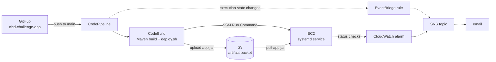

# Path 1 — AWS-Native CI/CD Pipeline

A complete CI/CD pipeline for a Java Spring Boot application, built entirely from AWS-native services and provisioned with Terraform. One of three parallel implementations of the same delivery problem built to compare orchestration approaches.

## Architecture



- **No SSH anywhere** — no port 22, no key pairs. All instance access and deployment via SSM.
- **No CodeDeploy** (unavailable on this account plan) — replaced by a hand-written `deploy.sh` that uploads the JAR to S3 and triggers the deployment on EC2 via SSM Run Command.
- Terraform only, remote state in S3 with native locking, region eu-west-1.

## Highlights

**Deployment failure actually fails the pipeline.** CodePipeline has zero visibility into what happens inside a CodeBuild `post_build` shell command — the gap CodeDeploy's health checks would normally close. `deploy.sh` polls the SSM command status and explicitly exits non-zero on any failure or timeout, so a broken deployment fails the build phase and the pipeline, instead of reporting false-positive success.

**Verified by full rebuild, not just green checkmarks.** The entire stack was destroyed and re-applied from zero to prove it is self-sufficient. This rebuild caught a real gap that incremental testing had masked: nothing had ever provisioned a Java runtime on the deploy target (CodeBuild's Corretto runtime exists only inside the build container). Fixed with `user_data`, then re-verified from scratch.

**Deliberate scoping of what to monitor.** EventBridge → SNS emails on pipeline success/failure; a CloudWatch alarm on EC2 status checks covers the one gap events can't — the instance dying between deployments. A CodeBuild-failure alarm was considered and rejected as redundant with the event-based notifications.

**CodePipeline is somewhat redundant here.** With deployment embedded in CodeBuild, CodePipeline contributes mainly the trigger and dashboard; CodeBuild alone with a GitHub webhook could do nearly the same. It was kept deliberately as the contrast with Path 2, where CodePipeline's native ECS deploy stage is genuinely load-bearing.

## Known limitations

- Brief downtime on each deploy (`systemctl restart` — no overlap between old and new process; rolling deploys are Path 2's territory)
- No automated rollback if the app fails after a successful deployment (the CodeDeploy gap, acknowledged rather than hidden)
- Status-check alarm monitors the machine, not the application — process death is covered by systemd `Restart=always`, true app health would need an ALB health check

## Repository layout

```
path1/
├── providers.tf      # AWS provider, S3 backend with native locking
├── variables.tf      # Input variables (notification email, etc.)
├── data.tf           # AMI lookup via SSM parameter
├── network.tf        # VPC, subnet, IGW, routing, security group
├── ec2.tf            # Instance, instance profile, user_data (Java install)
├── eip.tf            # Elastic IP
├── storage.tf        # Artifact bucket: versioning, encryption, lifecycle
├── iam.tf            # Roles, trust policies, identity policies
├── codebuild.tf      # Build project
├── codestar.tf       # GitHub connection
├── codepipeline.tf   # Pipeline (Source + Build stages)
├── event.tf          # EventBridge rule for pipeline state changes
├── sns.tf            # Topic, email subscription, topic policy
├── cloudwatch.tf     # Log group, EC2 status-check alarm
└── outputs.tf        # Useful outputs (instance IP, etc.)
```

App repository: [cicd-challenge-app](https://github.com/MarkOfV/cicd-challenge-app) — Spring Boot 2.7 (Java 8), `buildspec.yml`, `deploy.sh`.

## Deploying it yourself

1. Create an S3 bucket for Terraform state and set it in `providers.tf`
2. `terraform init && terraform apply` (prompts for a notification email)
3. Authorize the CodeStar connection in the AWS console (one-time manual OAuth step — Terraform cannot do this)
4. Confirm the SNS subscription from your inbox
5. Push to the app repo's `main` branch — the pipeline builds and deploys automatically; the app responds on port 8080 (`/` and `/health`)
